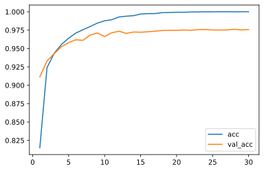

# Keras4Torch

A High-Level Keras-Style API for PyTorch

[](https://www.python.org)
[](https://github.com/blueloveTH/keras4torch)

## Installation

Keras4Torch is available at [the Python Package Index](https://pypi.org/project/optuna/) and on [Anaconda Cloud](https://anaconda.org/conda-forge/optuna).

```bash
# PyPI
$ pip install keras4torch

# Anaconda Cloud
$ conda install -c conda-forge keras4torch
```


## Quick Start

The usage of Keras4Torch is almost the same with Keras.

Let's start with a simple example with MNIST!

```python
import torch
import torchvision
from torch import nn

import keras4torch
```

#### (1) Preprocess Data

```python
mnist = torchvision.datasets.MNIST(root='./', download=True)
X, y = mnist.train_data, mnist.train_labels

X = X.float() / 255.0	# scale the pixels to [0, 1]

x_train = X[:40000]; y_train = y[:40000]
x_test = X[40000:]; y_test = y[40000:]
```

#### (2) Define the Model

```python
model = torch.nn.Sequential(
    nn.Flatten(),
    nn.Linear(28*28, 512), nn.ReLU(),
    nn.Linear(512, 128), nn.ReLU(),
    nn.Linear(128, 10)
)
```

#### (3) Wrap the Model

```python
model = keras4torch.Model(model)
```

#### (3) Compile Loss and Metric

```python
model.compile(optimizer='adam', loss=nn.CrossEntropyLoss(), metrics=['acc'])
```

#### (4) Training

```python
history = model.fit(x_train, y_train,
                	epochs=30,
                	batch_size=512,
                	validation_split=0.2,
                	)
```

```txt
Train on 32000 samples, validate on 8000 samples:
Epoch 1/30 - 0.7s - loss: 0.7440 - acc: 0.8149 - val_loss: 0.3069 - val_acc: 0.9114 - lr: 1e-03
Epoch 2/30 - 0.5s - loss: 0.2650 - acc: 0.9241 - val_loss: 0.2378 - val_acc: 0.9331 - lr: 1e-03
Epoch 3/30 - 0.5s - loss: 0.1946 - acc: 0.9435 - val_loss: 0.1940 - val_acc: 0.9431 - lr: 1e-03
Epoch 4/30 - 0.5s - loss: 0.1513 - acc: 0.9555 - val_loss: 0.1663 - val_acc: 0.9524 - lr: 1e-03
... ...
```


#### (5) Plot Learning Curve

```
history.plot(kind='line', y=['acc', 'val_acc'])
```



#### (6) Evaluate on Test Set

```python
model.evaluate(x_test, y_test)
```

```txt
OrderedDict([('loss', 0.121063925), ('acc', 0.9736)])
```


## Communication

- [GitHub Issues] for bug reports, feature requests and questions.
- [QQ Group] for interactive chat with developers.

[GitHub issues]: https://github.com/blueloveTH/keras4torch/issues
[QQ Group]: https://xxx


## Contribution


