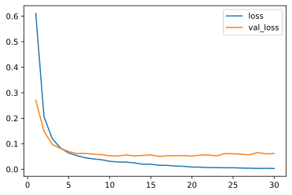

# Keras4Torch

[(Documentations)](https://keras4torch.readthedocs.io/en/latest/?badge=latest) [(Dev Logs)](https://github.com/blueloveTH/keras4torch/discussions/3)

#### "An Easy-to-Use Wrapper for Training PyTorch Models❤"

[](https://www.python.org)
[](https://pypi.org/project/keras4torch)
[](https://pepy.tech/project/keras4torch)
[](https://pypi.python.org/pypi/keras4torch)
[](https://keras4torch.readthedocs.io/en/latest/?badge=latest)
[](https://github.com/blueloveTH/keras4torch/blob/master/LICENSE)

Keras4Torch is a Keras-style framework using PyTorch as its backend. It is designed for Kagglers and researchers with a focus on quick experimenting. There are two sub-packages.

+ (main) `keras4torch`

    Provides an easy way to train PyTorch models compatible with Keras.

+ (extension) `torchlab`

    Builds a ready-to-use module/algorithm database along with the community.

## Installation

```
pip install keras4torch
```

Keras4Torch supports PyTorch 1.6 or newer.


## Quick Start

Let's start with a simple example of MNIST!

```python
import torch
import torchvision
from torch import nn

import keras4torch as k4t
```

#### Step1: Preprocess Data

```python
mnist = torchvision.datasets.MNIST(root='./', download=True)
X, y = mnist.train_data, mnist.train_labels

X = X.float() / 255.0    # scale the pixels to [0, 1]

x_train, y_train = X[:40000], y[:40000]
x_test, y_test = X[40000:], y[40000:]
```

#### Step2: Define the Model

Use `KerasLayer` for automatic shape inference, which can free you from calculating the input channels.

```python
model = torch.nn.Sequential(
    nn.Flatten(),
    k4t.layers.Linear(512), nn.ReLU(),
    k4t.layers.Linear(128), nn.ReLU(),
    k4t.layers.Linear(10)
)
```

Wrap the model by `k4t.Model` and build `KerasLayer`(s).

```python
model = k4t.Model(model).build([28, 28])
```

#### Step3: Config Optimizer, Loss and Metric

```python
model.compile(optimizer='adam', loss=nn.CrossEntropyLoss(), metrics=['acc'])
```

#### Step4: Training

```python
history = model.fit(x_train, y_train,
                	epochs=30,
                	batch_size=512,
                	validation_split=0.2,
                	)
```

```txt
Train on 32000 samples, validate on 8000 samples:
Epoch 1/30 - 0.7s - loss: 0.7440 - acc: 0.8149 - val_loss: 0.3069 - val_acc: 0.9114 - lr: 1e-03
Epoch 2/30 - 0.5s - loss: 0.2650 - acc: 0.9241 - val_loss: 0.2378 - val_acc: 0.9331 - lr: 1e-03
Epoch 3/30 - 0.5s - loss: 0.1946 - acc: 0.9435 - val_loss: 0.1940 - val_acc: 0.9431 - lr: 1e-03
Epoch 4/30 - 0.5s - loss: 0.1513 - acc: 0.9555 - val_loss: 0.1663 - val_acc: 0.9524 - lr: 1e-03
... ...
```

#### Step5: Plot Learning Curve

```python
history.plot(kind='line', y=['acc', 'val_acc'])
```



#### Step6: Evaluate on Test Set

```python
model.evaluate(x_test, y_test)
```

```txt
{'loss': 0.121063925, 'acc': 0.9736}
```


## Contribution

#### For `keras4torch`

If you have problems when using `keras4torch` or want to add new features to it, please start a topic in [Github Discussions](https://github.com/blueloveTH/keras4torch/discussions) or create a [Pull Request](https://github.com/blueloveTH/keras4torch/pulls).


#### For `torchlab`

Anyone can upload module or algorithm to `torchlab` then share it with the community.

For doing this, you need to prepare your code and create a pull request to `./torchlab`.

There are several directories in `./torchlab`. Make sure you are choosing the correct directory.

+ applications/

    Configurable solutions such as a whole model architecture.

+ layers/

    Reusable modules that can be added to a wide range of networks.

+ losses/

    loss function that are not built-in of `torch.nn`

+ metrics/

    metrics that are not built-in of `keras4torch.metrics`

+ optimizers/

    optimizers that are not built-in of `torch.optim`

+ ... ...

The module or algorithm should contain a doc string, following the example format below.

```txt
Squeeze-and-Excitation Module 1D

See reference: `Hu, Jie, Li Shen, and Gang Sun. "Squeeze-and-excitation networks." Proceedings of the IEEE conference on computer vision and pattern recognition. 2018.`

Args:

* `reduction_ratio` (int, default=16)

* `channel_last` (bool, default=False)

Input: [N, C_in, L_in] by default and [N, L_in, C_in] if `channel_last=True`

Output: The same with the input

Contributor: blueloveTH
```


**Tips**

+ The doc string needs to describe the usage of the module clearly

+ Reference link is required
  
    + Using a URL

        ```
        See reference: https://github.com/blueloveTH/keras4torch
        ```

    + Or using a MLA style citation (Generate it via [Google Scholar](https://scholar.google.com/) then add backquotes to it)

        ```
        See reference: `Hu, Jie, Li Shen, and Gang Sun. "Squeeze-and-excitation networks." Proceedings of the IEEE conference on computer vision and pattern recognition. 2018.`
        ```

+ (Optional) Write your name as contributor in the last line

+ For more questions, please start a topic in [Github Discussions](https://github.com/blueloveTH/keras4torch/discussions) or send email to blueloveTH@foxmail.com