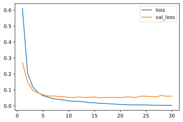

# Keras4Torch

**A compatible-with-keras wrapper for training PyTorch models✨**

`keras4torch` provides a high-level API to train PyTorch models compatible with Keras. This project is designed for beginner with these objectives: 

+   Help people who are new to PyTorch but familar with Keras
+   Reduce the cost for migrating Keras model implementation to PyTorch


## Installation

```
pip install keras4torch
```

PyTorch 1.6+ and Python 3.6+ is required.


## Quick start

Suppose you have a `nn.Module` to train.

```python
model = torchvision.models.resnet18(num_classes=10)
```

All you need to do is wrapping it via `k4t.Model()`.

```python
import keras4torch as k4t

model = k4t.Model(model)
```

Now, there're two workflows can be used for training.

The **NumPy workflow** is compatible with Keras.

+   `.compile(optimizer, loss, metrics)` for settings of optimizer, loss and metrics
+   `.fit(x, y, epochs, batch_size, ...)` takes raw numpy input for training
+   `.evaluate(x, y)` outputs a `dict` result of your metrics
+   `.predict(x)` for doing predictions


And **DataLoader workflow** is more flexible and of pytorch style.

+   `.compile(optimizer, loss, metrics)` same as NumPy workflow
+   `.fit_dl(train_loader, val_loader, epochs)` for training the model via `DataLoader`
+   `.evaluate_dl(data_loader)` same as NumPy workflow but takes `DataLoader`
+   `.predict_dl(data_loader)` same as NumPy workflow but takes `DataLoader`

The two workflows can be mixed.


## MNIST example

Here we show a complete example of training a ConvNet on MNIST.

```python
import torch
import torchvision
from torch import nn

import keras4torch as k4t
```

#### Step1: Preprocess data

```python
mnist = torchvision.datasets.MNIST(root='./', download=True)
x, y = mnist.train_data.unsqueeze(1), mnist.train_labels

x = x.float() / 255.0    # scale the pixels to [0, 1]

x_train, y_train = x[:40000], y[:40000]
x_test, y_test = x[40000:], y[40000:]
```

#### Step2: Define the model

If you have a `nn.Module` already, just wrap it via `k4t.Model`. For example,

```python
model = torchvision.models.resnet50(num_classes=10)

model = k4t.Model(model)
```

For building models from scratch, you can use `KerasLayer` (located in `k4t.layers`) for automatic shape inference, which can free you from calculating the input channels.

As is shown below, `k4t.layers.Conv2d(32, kernel_size=3)` equals `nn.Conv2d(?, 32, kernel_size=3)` where the first parameter `?` (i.e. `in_channels`) will be determined by itself.

```python
model = torch.nn.Sequential(
    k4t.layers.Conv2d(32, kernel_size=3), nn.ReLU(),
    nn.MaxPool2d(2, 2), 
    k4t.layers.Conv2d(64, kernel_size=3), nn.ReLU(),
    nn.Flatten(),
    k4t.layers.Linear(10)
)
```

A model containing `KerasLayer` needs an extra `.build(input_shape)` operation.

```python
model = k4t.Model(model).build([1, 28, 28])
```

#### Step3: Summary the model

```python
model.summary()
```

```txt
=========================================================================================
Layer (type:depth-idx)                   Output Shape              Param #
=========================================================================================
├─Conv2d*: 1-1                           [-1, 32, 26, 26]          320
├─ReLU: 1-2                              [-1, 32, 26, 26]          --
├─MaxPool2d: 1-3                         [-1, 32, 13, 13]          --
├─Conv2d*: 1-4                           [-1, 64, 11, 11]          18,496
├─ReLU: 1-5                              [-1, 64, 11, 11]          --
├─Flatten: 1-6                           [-1, 7744]                --
├─Linear*: 1-7                           [-1, 10]                  77,450
=========================================================================================
Total params: 96,266
Trainable params: 96,266
Non-trainable params: 0
Total mult-adds (M): 2.50
=========================================================================================
```

#### Step4: Config optimizer, loss and metrics

```python
model.compile(optimizer='adam', loss=nn.CrossEntropyLoss(), metrics=['acc'])
```

If GPU is available, it will be used automatically. You can also pass `device` parameter to `.compile()` explicitly.

#### Step5: Training

```python
history = model.fit(x_train, y_train,
                	epochs=30,
                	batch_size=512,
                	validation_split=0.2,
                	)
```

```txt
Train on 32000 samples, validate on 8000 samples:
Epoch 1/30 - 2.8s - loss: 0.6109 - acc: 0.8372 - val_loss: 0.2712 - val_acc: 0.9235 - lr: 1e-03
Epoch 2/30 - 1.5s - loss: 0.2061 - acc: 0.9402 - val_loss: 0.1494 - val_acc: 0.9579 - lr: 1e-03
Epoch 3/30 - 1.5s - loss: 0.1202 - acc: 0.9653 - val_loss: 0.0974 - val_acc: 0.9719 - lr: 1e-03
Epoch 4/30 - 1.5s - loss: 0.0835 - acc: 0.9757 - val_loss: 0.0816 - val_acc: 0.9769 - lr: 1e-03
... ...
```

#### Step6: Plot learning curve

```
history.plot(kind='line', y=['loss', 'val_loss'])
```



#### Step7: Evaluate on test set

```python
model.evaluate(x_test, y_test)
```

```txt
{'loss': 0.06655170023441315, 'acc': 0.9839999675750732}
```


## Communication

We have activated [Github Discussion](https://github.com/blueloveTH/keras4torch/discussions) for Q&A and most general topics!

For bugs report, please use [Github Issues](https://github.com/blueloveTH/keras4torch/issues).

